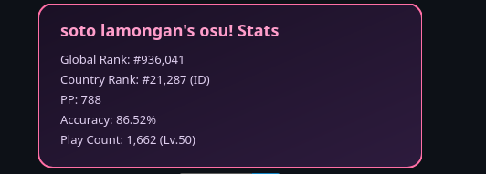

# osu! Stats Card

Generate an SVG stat card for your osu! profile, embeddable in your GitHub README.
<p align="center">

</p>

## Just want to use it?

You don't need to set up anything. Just add this to your GitHub README, replacing `USERNAME` with your osu! username:

```md

```

Optionally add `&mode=taiko` (or `fruits` / `mania`) if you want stats for a mode other than standard.

> **Note:** the shared deployment applies a rate limit (20 requests/minute per IP) to keep it usable for everyone. If you're building something with heavier or high-frequency usage, or just want your own independent instance, we recommend deploying your own copy — see below.

## Self-hosting your own deployment

Recommended if you're hitting the shared instance's rate limit, or just want full control over your own copy.

1. Register your own OAuth application at https://osu.ppy.sh/home/account/edit#oauth (leave the callback URL blank — this project only uses the Client Credentials Grant)
2. Fork or clone this repo
3. Push it to your own GitHub account
4. Import the repo on https://vercel.com/new
5. In Project Settings → Environment Variables, add `OSU_CLIENT_ID` and `OSU_CLIENT_SECRET` with the values from step 1
6. Deploy — Vercel gives you a public URL like `your-project.vercel.app`

Your deployment has its own rate limit and cache, fully independent from the shared one. Embed it the same way:
```md

```

## Local development

```bash
npm install -g vercel
npm install
vercel dev
```

(Run `vercel dev` directly — not `npm run dev`.)

(Copy `.env.example` to `.env.local` and fill in your credentials first.)

Then open:
```
http://localhost:3000/api/osu-card?user=USERNAME&mode=osu
```

`mode` is optional (`osu`, `taiko`, `fruits`, `mania`), defaults to `osu`.

## Roadmap
- [x] In-memory caching to reduce osu! API calls (5 min TTL)
- [x] Per-IP rate limiting (20 req/min) and input validation
- [ ] Persistent cache with Vercel KV (survives cold starts)
- [ ] Recent top play display
- [ ] Color theme options
- [ ] Chart stats
- [ ] User avatar

## Tech Stack
- Vercel Serverless Functions (Node.js runtime)
- osu! API v2 (OAuth2 client credentials)
- Raw SVG generation (no external image library)